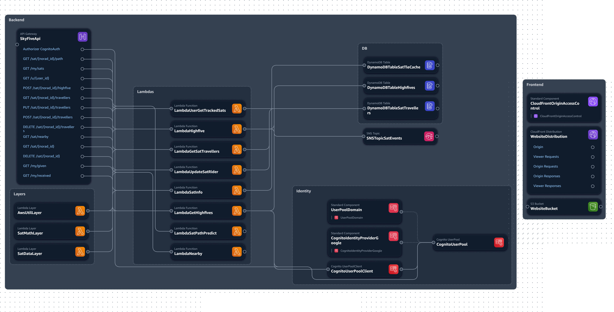

# 🛰️ SkyFive 🖐️


*<sub>Satellite data courtesy of [ZenithAPI](https://zenithapi.space/api-docs) and [NASA's TLE API](https://tle.ivanstanojevic.me/).</sub>*


SkyFive is social interaction web application, allowing users to "high-five" each other across nearby satellites.


---

*<sub>**Note:** This repo showcases only **the AWS backend**. For the full project (inc. the Frontend site) and installation instructions, visit the [SkyFive Repo](https://github.com/ShacharTs/Sky-Five-Sky-High).</sub>*

---

SkyFive's Backend is built on **AWS** and designed as *fully serverless* infrastructure. The Backend is defined as **IaC** & deployed with **AWS Serverless Application Model (SAM)**.



*<sub>AWS Infrastructure Chart</sub>*

## AWS Resources
* API Gateway
* Lambda
* DynamoDB
* SNS
* Cognito
* S3
* CloudFront

## Deployment

1. **Prep Google Identity**

    If you'd like to deploy the AWS Backend with Google OAuth integrated with Cognito, you'll need to create Google API credentials and in Deployment plug them into the SAM parameters.

   1. Navigate to the [Google Cloud Console](https://www.google.com/search?q=https://console.cloud.google.com/).
   2. Create a new project (or select an existing one) and navigate to **APIs & Services > Credentials**.
   3. Create an **OAuth client ID** (Web application type).
   4. Note down the **Client ID** and **Client Secret**. *(You will add the callback URLs later).*

2. **Deploy Backend (AWS SAM)**
    
    ```bash
    sam build && deploy --guided
    ```
    
    *Parameters:*
    * **Stack Name** (default: `skyfive-stack`)
    * **AWS Region** (default: `us-east-1`)
    * **LambdaRoleArn:** ARN of a lambda IAM role to apply to all lambdas.
    * *Requires permissions for basic Lambda execution, DynamoDB CRUD, Cognito UserPools Read, and SNS Access*.
    * **GoogleClientId** (from Step 1).
    * **GoogleClientSecret** (from Step 1).
    * **AdminEmail** (Admin email to receive satellite event alerts).

3. **Integrate Google Identity**

   1. Return to the **Google Cloud Console** > Credentials.
   2. Edit your OAuth client.
   3. Add your Cognito User Pool domain to the **Authorized JavaScript origins** (e.g., `https://skyfive-<account-id>.auth.<region>.amazoncognito.com`).
   4. Add the Cognito callback endpoints to the **Authorized redirect URIs**:
      * `https://skyfive-<account-id>.auth.<region>.amazoncognito.com/oauth2/idpresponse` *(or from step 2)*.
      * `https://<your-cloudfront-domain>/callback.html` *(or from step 2)*.

4. **Frontend Website Configuration**
   * Configure your frontend website with the **AWS API Gateway**'s base URL & configure the UI buttons (Login, Logout, Callback) to use the **Cognito & CloudFront URLs** *(from step 3 or from the AWS Console)*. 
   * *It is recommended to use the official frontend given in the full [SkyFive Repo](https://github.com/ShacharTs/Sky-Five-Sky-High).*
